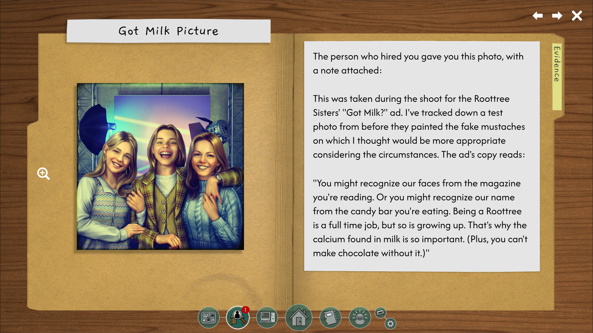
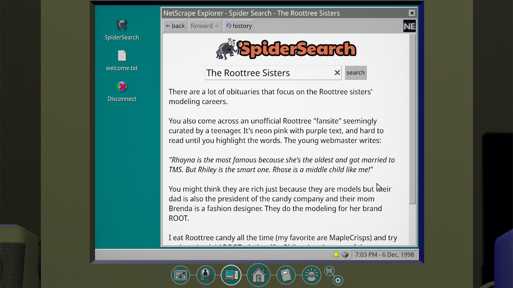

Played on _Steam_. Total playtime: _13 hours_

In 2018, [Return of the Obra Dinn](https://store.steampowered.com/app/653530/Return_of_the_Obra_Dinn/) set the puzzle world aflame with its fairly unique, genre defining approach to puzzling. Players would be given a large amount of missing information and brought into a space where they would have to hunt for numerous clues to fill in as much missing clues as they could while also piecing together the story of what transpired. This served as heavy inspiration for games like [Case of the Golden Idol](https://store.steampowered.com/app/1677770/The_Case_of_the_Golden_Idol/) (along with its sequel [The Rise of the Golden Idol](https://store.steampowered.com/app/2716400/The_Rise_of_the_Golden_Idol/) which replaced the empty ship manifest and the abandoned ship in Obra Dinn with static snapshots in time and an intangible fourth wall of missing information. The Roottrees are Dead takes this concept and evolves it many steps forward to create a thoroughly engaging puzzle adventure with a fantastic narrative to accompany it.

We begin with a news broadcast in the late 90s of a famous and wealthy family known as the Roottrees being declared dead, leaving behind a vast candy company fortune. You play as a supposedly popular genealogist, visited by a mysterious stranger in the dead of the night, asking you to find all the members of their clan and figure out who deserves a cut of the massive pie, as well as promising you an unspecified but surely oversized reward on successful execution of this task. Due to certain story driven circumstances, every single blood relative is to be eligible for significant compensation which makes uncovering all this critical for the estate of the surviving family.

You're given a massive corkboard with all the members of the family tree redacted so you don't know their names, what they look like or their occupations. This still means you're not starting from scratch since the board leaves behind information on who's married, who's been divorced, as well as how many kids they had. You're given some pieces of evidence by this mysterious stranger as a starting point and from there on you have access to a facsimile of 90s era internet with a Google or AskJeeves style search interface, an online library of books and published newspapers, a printer to print new evidence as you go, and your obviously massive brain to put to good use.

The gameplay from this point on involves diving deep into the lives and significant events of all those involved in the family. The pieces of evidence will give you photos of significant people in the family that you collect by clicking on their faces. Each piece of evidence also contains significant amounts of accompanying text that provides details about the persons involved in the evidence. For eg. you may get a book written by an author that gives an account of a relative in the text as well as having a photo of them in the cover. You can also select text from almost any point in the game and highlight it for storage in your journal for reference later or search for it in the search interface or search for those terms in publications. As you browse through sites, books and publications over the internet, any significant evidence you find, such as articles or books, will be printed out or procured and logged as additional evidence so you can extract any additional details you can extract out of them. This process very quickly spirals into a labyrinth of names, terms, locations and almost anything else you can think of that you think is significant to finding out more about this family. It is also critical to use reasoning and logic to intuit certain "answers" since a lot of the time, especially as you get deeper and deeper into figuring out more segments and members, you don't get obvious clues as to someone's relationship to another person. Sometimes your only clues may be that they were born on a certain date which most likely makes them a a particular person's child who was pregnant at the time.

While this could very easily have turned into a frustrating experience, the game gives you certain graces. In an Obra Dinn inspired mechanic, when you get the photos, names and occupations of three people right, they get "locked in" along with additional information such as the spouses of blood relatives or extra photos that you attach to the people on the board. The difficulty increases as this number of required correct people increases as well as the amount of information you get about certain family members, especially the most recent generation of school and college students, becomes more and more sparse. While most of the older family members might be fairly well known for their accomplishments in business or elsewhere, clearly you can't expect a 4 year old baby to show up in the news for making a blockbuster business deal. But due to the advent of the internet, maybe you can find information on them elsewhere...?

This process of parsing every single thing you find for any sort of clue becomes a thoroughly entertaining experience since every single piece of additional evidence you find allows you to add in more information to the board and locking in a fresh set of blood relatives feels oh-so-satisfying. The button to acknowledge the locked in entries even says "Boo Yah" and every single time I got a fresh set of correct locked in entries I audibly went "boo-ya-ka-shaaa!" because the waves of dopamine at every fresh entry felt so earned. The game rides a perfect balance of avoiding giving you information for free with overtly obvious hints but also never making you feel like any of the connections between the pieces of evidence was bullshit. This includes the absolutely inspired hint system, visualised in the form of a rubber duck in another cheeky choice since they want to make you feel like you're "rubber ducking" and figuring the answer out for yourself instead of being given the solution outright. The hint system begins by pointing you in the general direction of potential new wells of information by giving you obtuse hints like "This book you have seemed to talk about some additional organisations that you could probably look into" and you can keep requesting hints with increasing verbosity until it gives you the answer outright. This is an excellent way to keep the difficulty high for yourself so you can continue to figure things out until you willingly acquiesce to being handed down the answer when finally giving up.

Of note is the absolutely stellar writing in all of the evidence and hints that is a large part of why the difficulty remains perfect throughout. You're not shown entire websites with styling layouts, nor are you given the entire text of books or publications you find. Instead, you, as the player, are told that the player character, the genealogist, parsed through and read the whole thing and extracted what to them feels like the most relevant information for the player. This helps keeps things concise and relevant so you're never overwhelmed with reams of useless, extraneous information. A lot of the entires are also surprisingly funny, eliciting uproarious laughter from me at multiple times with how self-aware and cheeky it would be. OF COURSE you don't have access to risque magazine pictures to gather for your evidence, what are you a pervert?

This excellence in writing extends to the surprisingly detailed and rich story that you uncover. It's no detective mystery novel since you are looking at things from a fairly dispassionate, outside perspective and don't have the connection to any of the family members you're identifying on the board. Still, the details of certain members can bring out a palpable sense of joy at their accomplishments, suspicion at their actions, and some degree of grief when learning of how they were treated or their eventual fate. The game has a lot to say about generational familial wealth, the patriarchal traps the family have laid for themselves, and the greed on display here by all the outstretched hands vying for their chunk of flesh. But there is also more going on that the game has to say that I will not go into due to spoiler reasons that you will uncover as you reach the last segments of the story. It felt extremely rewarding to piece together not only this complicated puzzle but also the story of what happened through the years.

Once you're done with the base game, the second phase of the family tree unlocks in the form of a second mode appropriately called "Roottreemania" that ramps up the difficulty from the get go where the threads are even more tenuous and significantly more information needs to be parsed to form solid connections than ever before. No longer are you given a list of complete names and you must instead search and select the first name and last name of a person separately. At the final segment of this mode, I began to liberally use the hint system because the amount of text containing obscure names that I'd forgotten about hours ago reached a point close to overwhelming. It is to the credit of the writers and the designers that there were only two instances where I felt some of the information given to you to piece certain things was not enough to come to a definitive conclusion.

The presentation is largely not particularly noteworthy. The since you're never presented completed websites and are only presented a summary of the text at all times, there's not much to say about the 90s internet that you use to search for information. The pieces of evidence also largely simply consist of (admittedly quite well drawn) illustrations of the family members accompanied by text. There are some notable pieces of music by in-universe bands but otherwise the soundtrack mostly consists of a mix of smooth jazz and electronica that are meant to provide ambience to your sleuthing but not distract you from your flow state.

Aside from the filmsiness of a few scant bits of information mentioned above towards the end of Roottreemania, minor issues include the inability to search through the printed evidence in your hoard and a couple of extremely inconsequential and unnecessary image rearranging puzzle games somewhere in the middle where you have to fix a few misaligned photos that provided no challenge whatsoever. I could mention the immersion breaking nature of every internet search result and evidence summary containing precisely the information you need readily parsed but I praised the game for exactly this earlier so I feel I'd be a hypocrite if I made this a sticking point.

This is a superb iteration of the formula that Obra Dinn inspired so many years ago and manages to evolve beyond those trappings to become its own unique work of art that I genuinely found even more enjoyable than Obra Dinn. I could not put down the game while I was playing it and now I find myself sorely wanting more. The dev team's [next game](https://store.steampowered.com/app/3641000/The_Incident_at_Galley_House/) is slated for 2026 and I cannot wait.
